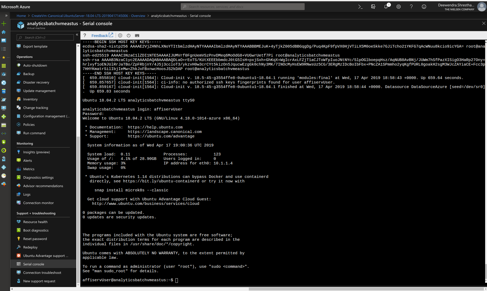

# SETTING AZURE BATCH ACCOUNT

## Creating Azure Batch Account
* Log into azure portal and create a "Batch Service" resource
* Name the batch account following the convention [SERVICE NAME][RESOURCE TYPE][ENVIRONMENT][INSTANCE NO]
    
    For eg: "ranalyticsbadev01" where 
    * "ranalytics" is service name
    * "ba" is short hand notation for resource type "batch account"
    * "dev" is short hand notation for environment "development"
    * "01" is instance no     
     
* Attach a storage account with the batch account preferably following the same convention as we used for the account name. Eg: "ranalyticsstgdev01"
* Enable diagnostic on the batch account in order to receive events when a task changes its state.
* When creating event hub make sure you check the "Stream to an event hub" and "ServiceLog" check boxes

Detailed recording for creating batch account can be viewed [here](https://drive.google.com/open?id=1w7C6vjYlavqsx0c7_vHL1uj6mSGWNXIJ).

### PROVISIONING VM

When creating batch pool, we use custom VM image so that all the dependencies needed to run our application is pre-installed in the compute node. Here are setps to create create and VM, install the dependencies and create an image out of it.
    
1) Add a new Ubuntu VM resource by going to Home > Virtual machines in azure portal and then click on Add icon


2) Fill in the basics details for the VM, make sure to select the "Region" correctly. The region where the batch account is deployed must match with the region where the VM is deployed or else you wont be able to select the VM image when creating the pool for batch account. Set username/password to the VM, you will need this in later step to install the dependency packages.

3) Once the VM has been created, click on the newly created VM resource

4) On the right pane, find and click option "Serial Console" which will open up the ssh console. Type in the username and password to login.


5) Create a shell script file named "install-r.sh" to install R binary with following script:
```sh
if [ ! -f /usr/bin/R ]; then
    sudo apt -y install apt-transport-https software-properties-common
	sudo apt-key adv --keyserver keyserver.ubuntu.com --recv-keys E298A3A825C0D65DFD57CBB651716619E084DAB9
	sudo add-apt-repository 'deb https://cloud.r-project.org/bin/linux/ubuntu bionic-cran35/'
	sudo apt update
	sudo apt -y install r-base r-base-core r-recommended
	
	#FOR RODBC cran package to work
	sudo apt-get -y install libiodbc2-dev
	sudo apt-get -y install r-cran-rodbc
	sudo apt-get -y install unixodbc unixodbc-dev
	
	R --version
fi
```
6) Run the script to install R 
```sh
sudo sh install-r.sh
```
7) Create a R script file named "install-r-libraries.r" to install common R libraries with following script:
```R
repos <- "http://cran.rstudio.com/"
list.of.packages <- c("abind", "base64", "cluster", "colorspace", "curl", "data.label", "digest", "doMPI", "doParallel", "doSNOW", "fBasics", "fields", "foreach", "gdata", "ggplot2", "gmodels", "gplots", "grid", "gtools", "here", "img", "iterators", "jpeg", "jsonlite", "MASS", "matrixStats", "MCMCpack", "nws", "outliers", "outliers", "pixmap", "plot3D", "plotrix", "plyr", "png", "polyr", "quadprog", "RCurl", "reshape2", "rJava", "RJDBC", "rjson", "RJSONIO", "RODBC", "sendmailR", "snowfall", "som", "SuppDists", "xgboost", "XLConnect", "xlsx", "XML", "yaml", ifelse(test = length(grep(pattern = "2.15",x = R.version.string,fixed = T))>0,"tcltk","tcltk2"))
old.packages <- old.packages()
new.packages <- list.of.packages[!(list.of.packages %in% installed.packages()[,"Package"])]
if(length(old.packages)) update.packages(old.packages, repos=repos)
if(length(new.packages)) install.packages(new.packages, repos=repos)
```

and then execute it using command:

```sh
sudo R -f install-r-libraries.r
```

Usually we have noticed that the RCurl library still doesnot get installed even after runnign this script. Do a quick check by running R bash and then run 

```require("RCurl")```

If it says the package was not found then run the following:

```sh
sudo apt-get install aptitude
sudo apt-get install libcurl4-openssl-dev
sudo apt-get install libxml2-dev
```

Open the R shell again and run ```install.packages("RCurl")```

Verify that the RCurl package has been installed by exiting out of shell and try running ```require("RCurl")``` in new R shell.

8) Once the installation is complete create image of the VM using instructions provided here : https://docs.microsoft.com/en-us/azure/virtual-machines/linux/capture-image

Example:
```sh
az vm deallocate --resource-group BUYCTOINNOV --name duseanalyticslpodoegenerator01vm

az vm generalize --resource-group BUYCTOINNOV --name duseanalyticslpodoegenerator01vm

az image create --resource-group BUYCTOINNOV --name duseanalyticslpodoegenerator01vmi --source duseanalyticslpodoegenerator01vm --location "East US"
```
