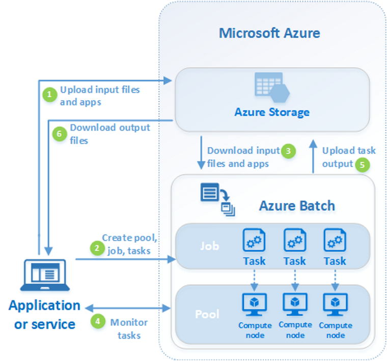

# UNDERSTANDING AZURE BATCH

Azure batch is a solution/resource provided in azure to run large-scale parallel and high-performance computing applications efficiently in the cloud. For more information about azure batch please visit the [azure documentation site](https://docs.microsoft.com/en-us/azure/batch/).

## Ideal use case scenarios
Azure batch is a really good solution when we need to run tasks that uses relatively large amount of resources. These resources could be defined in terms of time, memory, storage or even cost.

## What, where and how of azure batch?

###WHAT : Application Package
The power of azure batch comes because of clean separation and abstraction of what you want to run and where you want to run it. What you want to run is defined in terms of applications, azure documentation defines application as :

> an application refers to a set of versioned binaries that can be automatically downloaded to the compute nodes in your pool. An application package refers to a specific set of those binaries and represents a given version of the application.

The application binaries are uploaded to a batch account as a zip file.  

###WHERE : Pool
A pool in azure batch represents a set of automatically scalable VM resources where the application would be run.

> You enable automatic scaling on a pool of compute nodes by associating with it an autoscale formula that you define. The Batch service uses the autoscale formula to determine the number of compute nodes that are needed to execute your workload. Compute nodes may be dedicated nodes or low-priority nodes. Batch responds to service metrics data that is collected periodically. Using this metrics data, Batch adjusts the number of compute nodes in the pool based on your formula and at a configurable interval.

This concept of pool is where we derive most of the flexibility and power. A given pool contains VM(s) of specific size that determines it processing, memory and storage capacity so we can design our solution in optimal fashion based on application needs or business needs. For eg: for single threaded process intensive task we can define a pool with VM size that has single high core cpu speed, on the other hand if our application uses multi-threading then we can select VM size that gives more cpu cores etc.

Full list of VM sizes with their specifications can be found [here](https://azure.microsoft.com/en-us/pricing/details/batch/).

###HOW : Job
We execute an application in a pool by defining a task within a job. Job represents a collection of tasks in various states(active/running/completed) which uses same pool and same set(or subset) of applications. Once a task is completed we store the outputs generated by the task in the storage account(blob storage) in the cloud itself.

## Overview

## Advantages
* Scalable, flexible, guaranteed to be available are few of many "abilities" we get when moving to cloud
* A generic solution for class of similar problem. Some of the possibilities are:
    * replace jet to carry out R runs
    * replace EA service to do lock down checks
    * solve for download issue for large survey 
* Can support different OS image and configuration as opposed to VM scale set where the OS image has to be same.     
* Ability to stop a task once it has been initiated/started, hence avoiding wastage of resources
* We get event based push notification by default when enabling diagnostics hence we can move away from polling or quartz like technology
* Easy/fast to deploy solution, we do not need to involve devOps until a solution has been flushed out
* Cost effective since we can bring up nodes only when tasks are available to be run

## Disadvantages
* Its not effective solution for small/short running tasks(unless you have static pool)
* There is latency/wait period for tasks for dynamic pool
    * will have to wait for VM node to be available(re-scale period)
    * small VM spin up time  
         
 